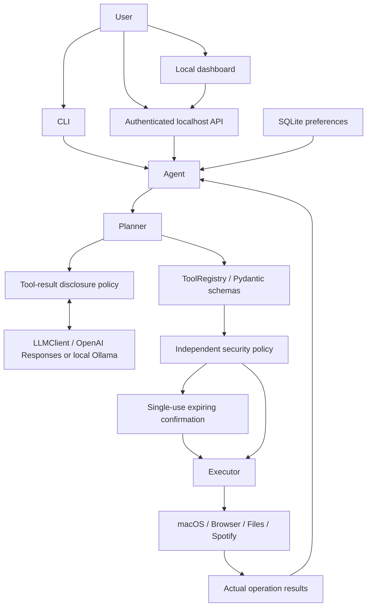

# Bridge

Optional voice capture, local/remote speech-to-text, local spoken responses, and an
explicitly started wake-word listener are documented in [Voice setup](docs/VOICE.md).
Start with `python -m app.main --voice-once`; microphone access is off in normal modes.

A Python 3.12+ local macOS assistant with natural-language tool selection, native
application controls, a CLI, a local dashboard, and an authenticated localhost FastAPI service.
This is an executable foundation, not an autonomous GUI operator.

**Choose local or remote inference:** `LLM_PROVIDER=ollama` uses a loopback Ollama
server; `openai` uses OpenAI. In remote mode, messages and recent conversation
context leave your Mac, while tool result details are withheld by default.
Screenshots are saved locally; their pixels are never uploaded.
Do not put credentials in messages. No API key is included in this repository.

## Architecture



The planner requests tools; it cannot run code. The executor validates every
call, evaluates static and argument-dependent risk, and executes steps in order.
A failure stops the remaining plan and preserves completed steps. There is no
rollback of already completed OS actions.

The OpenAI adapter implements the [official Responses function-calling flow](https://developers.openai.com/api/docs/guides/function-calling).
It sends registered schemas, preserves response items, returns function results,
and asks the model for the next action or final response. Provider-specific code
is confined to `app/llm/`; the factory selects the OpenAI Responses adapter or
the native Ollama adapter. Both return the same validated tool-call structure.

```text
app/
  main.py                  CLI and localhost server entry point
  bootstrap.py             Dependency injection and tool registration
  agent/
    agent.py               Bounded tool loop and confirmation resume
    planner.py             Provider-independent planning
    executor.py            Validation, policy, sequential execution, logging
    context.py             Per-request execution state
  llm/                     Provider factory, OpenAI and Ollama adapters, prompts, models
  tools/
    base.py, registry.py   Reusable tools and dynamic registry
    macos/applescript.py   Native subprocess and AppleScript boundary
    system/                Apps, running applications, volume
    browser/browser.py     URL/search and isolated Playwright infrastructure
    files/files.py         File, folder, project opening and folder creation
    terminal/terminal.py   Reviewed command policy; no shell
    spotify/spotify.py     Native playback and future provider protocol
    screen/screenshot.py   Screenshots and future perception protocols
  security/                Risk levels, protected paths, confirmations
  memory/                  Replaceable repository and SQLite preferences
  workflows/               Private SQLite checkpoints and single-process lock
  preferences/             Validated application defaults and confirmation tools
  ui/                      Packaged HTML/CSS/JS dashboard; no frontend build required
  desktop/                 Native menu-bar adapter, owned local service, .app launcher builder
  config/                  Environment-backed settings
  api/                     FastAPI factory and request/response schemas
tests/                     Mocked native operations and service/security tests
.env.example
pyproject.toml
```

## Install

### Local inference with Ollama

Install [Ollama for macOS](https://ollama.com/download/mac), then run a local-only
server. If the Ollama desktop application is already serving port 11434, quit it
before starting this terminal server:

```bash
OLLAMA_NO_CLOUD=1 ollama serve
```

In another terminal, download a tool-capable local model once:

```bash
ollama pull qwen3:8b
```

The example [qwen3:8b model](https://ollama.com/library/qwen3:8b) is a multi-gigabyte
download; model speed and memory use depend on your Mac. You can select another
locally installed tool-capable model through configuration. The application never
downloads models itself. Ollama's [local-only setting](https://docs.ollama.com/faq)
must be applied to the Ollama server, not merely placed in Bridge's `.env`.

Set these values in your existing `.env` (keep your API_TOKEN for the dashboard):

```dotenv
LLM_PROVIDER=ollama
LOCAL_LLM_BASE_URL=http://127.0.0.1:11434
LOCAL_LLM_MODEL=qwen3:8b
LOCAL_LLM_TIMEOUT_SECONDS=120
```

No OpenAI key is needed in this mode. Restart Bridge:

```bash
python -m app.main --doctor
python -m app.main --ui
# Or: python -m app.main
```

Try “Open Spotify and then open GitHub in Chrome,” “What apps are running?”,
and “Read my clipboard” (review the confirmation before approving). The dashboard's
Capabilities panel displays the selected provider, model, and disclosure policy.
`--doctor` checks configuration without loading or contacting a model.

The native [Ollama tool-calling API](https://docs.ollama.com/capabilities/tool-calling)
is used with non-streamed responses. Only numeric loopback HTTP endpoints are allowed;
DNS hostnames, credentials in URLs, remote endpoints, redirects, and environment
proxies are rejected or disabled. Known cloud-model names and model metadata
indicating remote inference are refused before chat history is sent. The local
service is still a trusted dependency: these checks cannot constrain a modified
server that forwards traffic or misreports metadata. Disable Ollama Cloud on that
server for local-only operation. Bridge never falls back to OpenAI.

Connection errors, missing models, malformed tool calls, and timeouts fail the
request without executing a guessed action. The request timeout bounds each
planning round; response bodies are limited to 2 MiB. Tool policies, sequential
execution, confirmation, journaling, and cooperative cancellation are unchanged.

### Remote tool-result privacy

The default remains `LLM_PROVIDER=openai`, but **result disclosure is now restricted
by default**, including for an existing `.env` with no privacy settings:

| Setting | What OpenAI receives from tool execution |
| --- | --- |
| `REMOTE_TOOL_RESULTS=status_only` | Tool/call identifiers, success and status; details withheld |
| `REMOTE_TOOL_RESULTS=allowlist` | Full results only for names in `REMOTE_TOOL_RESULT_ALLOWLIST` |
| `REMOTE_TOOL_RESULTS=all` | Full textual results, including paths, output and errors |

Example: let the remote model resolve saved projects and report running apps,
while retaining clipboard, file-search, terminal, and other results locally:

```dotenv
LLM_PROVIDER=openai
REMOTE_TOOL_RESULTS=allowlist
REMOTE_TOOL_RESULT_ALLOWLIST=["lookup_project","list_projects","list_running_apps"]
```

Use an actual JSON array, not a comma-separated string. Restart after changes.
An unknown tool name has no effect; future tools remain withheld unless explicitly
listed or `all` is selected. Model instructions cannot change this policy.
Local Ollama receives full results; the remote disclosure setting is inactive there.

Filtering is deterministic at the planner boundary and applies to immediate tool
outputs and saved in-memory step summaries used in subsequent turns. Local CLI/API
results still contain full details. Withheld data is marked for the model; dependent
actions such as alias lookup may require a user-supplied path, an explicit allowlist,
or local mode. This is an intentional behavior change from earlier versions.

This policy does **not** redact your messages, normal model-authored text, or data
you explicitly paste into a prompt. It cannot recall previous disclosures. Tool
approval authorizes execution; it does not override remote result restrictions.
Conversation and task results stay in process memory, and existing workflow journal
omission rules still apply. There is no hot provider switch, automatic cloud fallback,
or per-request disclosure override. Screenshots are not uploaded to either provider.

### Python environment

Requirements: macOS, Python 3.12 or newer, either an OpenAI API key or a local
Ollama server with a tool-capable model, and the applications
you want to control. Git commands require Apple's command-line tools. Chrome is
the default browser; Spotify is needed only for Spotify controls.

The existing PyCharm environment is Python 3.13. For a fresh checkout:

```bash
python3 -m venv .venv
source .venv/bin/activate
python -m pip install -e '.[dev]'
cp .env.example .env
```

Edit `.env` locally:

```dotenv
OPENAI_API_KEY=your-api-key
OPENAI_MODEL=gpt-4.1-mini
LLM_PROVIDER=openai
REMOTE_TOOL_RESULTS=status_only
DEFAULT_BROWSER=Google Chrome
DEFAULT_EDITOR=Visual Studio Code
DATABASE_PATH=./agent.db
LOG_LEVEL=INFO
API_TOKEN=choose-a-long-random-token
```

Choose an available tool-capable model for your OpenAI account. `OPENAI_MODEL`
is configurable and the default is not a claim about the latest model.
Generate an API token with `openssl rand -hex 32`, then paste it into `.env`.
Keep the file private (`chmod 600 .env`). `.env`, databases, environments, and
screenshots are not source-controlled. The CLI does not require `API_TOKEN`.

Additional settings: `SCREENSHOT_DIRECTORY` defaults to
`~/Library/Application Support/Bridge/screenshots`; `MAX_ROUNDS`
defaults to 12. Screenshots remain until manually removed.

## Run the CLI

From the project directory:

```bash
source .venv/bin/activate
python -m app.main
```

Examples:

- Open Spotify
- Open Chrome
- Open Mail
- Open VS Code
- Open GitHub
- Close Spotify
- What apps are running?
- Set my volume to 30 percent
- Take a screenshot
- Open my Downloads folder
- Run git status in /Users/yourname/Projects/nlp-api-go
- Open /Users/yourname/Projects/nlp-api-go in VS Code
- Open Spotify and then open GitHub in Chrome
- Pause Spotify
- Search the web for Go Temporal documentation
- Create a folder called reports on my Desktop

Enter `y` to approve a displayed confirmation; every other answer declines.
`exit`, `quit`, or Ctrl-D exits. Use actual existing paths for project commands.
Project aliases now persist across restarts. Use the actual directory on your Mac:

```text
Remember project "NLP" at /Users/yourname/Projects/nlp-api-go
Open my NLP project in VS Code
Run git status in my NLP project
List my saved projects
Forget project "NLP"
```

Saving, replacing, and forgetting an alias require confirmation. Forgetting only
removes the alias, not files. Names are case-insensitive and whitespace-normalized.
Missing or protected directories are rejected. Existing preference records are
preserved when the application adds its workflow table.

For ambiguous app requests, the model can now call `list_installed_apps` to inspect
standard application directories (including utility folders). This is bounded
directory discovery, not a complete Spotlight index. Apps outside those directories
may still be opened by exact name. The prompt distinguishes GoLand from PyCharm
and tells the model to leave unresolved clarifications behind when you change tasks.
Use `/reset` to explicitly clear conversation context.

The CLI hides routine JSON logs by default. Use `python -m app.main --verbose`
to show structured tool logs at your configured `LOG_LEVEL`.

## Run the API

```bash
source .venv/bin/activate
python -m app.main --api
```

Binds to **127.0.0.1:8000**. Run one process/worker: an OS file lock prevents two
updated agent processes using the same database. Stop the CLI before starting the
API with that database. Approval tokens and conversation context are in memory;
planned steps and completion metadata are checkpointed. Do not deploy publicly.
Interactive API documentation is at http://127.0.0.1:8000/docs, but browser-origin
action requests are deliberately rejected in `--api` mode; use the CLI or an
authenticated non-browser client. Use `--ui` for the local dashboard.

```bash
curl http://127.0.0.1:8000/health

# Set this to the API_TOKEN you placed in .env.
export DESKTOP_AGENT_TOKEN='your-local-api-token'
curl http://127.0.0.1:8000/api/v1/agent/message \
  -H "Authorization: Bearer $DESKTOP_AGENT_TOKEN" \
  -H 'Content-Type: application/json' \
  -d '{"message":"Open Spotify and then open GitHub in Chrome"}'
```

Responses contain `status`, `request_id`, `message`, and ordered `steps`.
A successful launch means macOS accepted the launch request; it does not prove
a web page loaded or an application finished startup. Every step includes the
tool name, call ID, success flag, and actual result or error.

When status is `confirmation_required`, review `confirmation.action` and
`confirmation.arguments`, then submit the returned token:

```bash
curl http://127.0.0.1:8000/api/v1/agent/confirm \
  -H "Authorization: Bearer $DESKTOP_AGENT_TOKEN" \
  -H 'Content-Type: application/json' \
  -d '{"token":"token-from-response","approved":true}'
```

Approval resumes the exact stored action, revalidates its schema and policy,
then continues the remaining plan. Tokens expire after five minutes, are
single-use, and disappear on restart. Declining cancels the remaining steps.
No LLM-exposed tool can grant approval.

## Run the dashboard

Stop your running CLI/API process, then start:

```bash
source .venv/bin/activate
python -m app.main --ui
```

Open **http://127.0.0.1:8000**. Enter `API_TOKEN` from your `.env` file to connect.
If it is empty, generate a value with `openssl rand -hex 32`, save it as `API_TOKEN`
in `.env`, and restart the server. Enter the local token, **not** your OpenAI key.
The dashboard is served in your browser; the native launcher below can manage its service.
No Node.js installation, frontend build, or Playwright installation is needed to use it.

The dashboard has four panels:

- **Conversation:** send natural-language requests, inspect step results, approve
  or decline exact actions, and clear conversational context.
- **Projects:** list, add, edit or forget aliases. Every write uses the existing
  executor and confirmation flow; forgetting an alias never deletes its folder.
- **Workflows:** inspect recorded steps and saved arguments, explicitly resume
  recoverable work, or cancel remaining work. Uncertain outcomes cannot be replayed.
- **Preferences:** change the default browser and project editor. Changes require
  approval, persist atomically in SQLite, and apply to newly planned actions without
  restarting. Already prepared plans retain their selected browser/editor.

UI management actions do not call the LLM. Chat still uses the configured provider.
The UI does not expose credentials, arbitrary settings, or a generic tool-execution
endpoint. Project forms require a typed path; no general filesystem browser is added.

The token is held only in page memory, never localStorage, sessionStorage, cookies,
or a URL. Disconnecting/reloading clears it and the rendered conversation. Reloading
does not cancel server-side work; inspect Workflows before repeating a request after
a connection failure. If an approval has expired, leave its review, inspect its
workflow, and explicitly resume if available. A fresh approval will be required.

`--ui` serves packaged assets and allows bearer-authenticated requests only from
that exact browser origin (scheme, host, and port). Foreign origins are rejected,
there is no CORS grant, frames are blocked, pages are not cached, and a restrictive
Content Security Policy prohibits inline scripts and third-party assets. Model and
tool text is rendered as text, not HTML. `--api` continues rejecting browser origins.
The service remains single-user, including across tabs, with one process per database.
Browser extensions and other software trusted by your browser remain outside this
application's isolation boundary.

Additional authenticated management routes:

```text
GET  /api/v1/projects
POST /api/v1/projects          {"name":"NLP","path":"/absolute/project/path"}
POST /api/v1/projects/forget   {"name":"NLP"}
GET  /api/v1/preferences
POST /api/v1/preferences      {"default_browser":"Safari","default_editor":"GoLand"}
```

All write routes above return `confirmation_required`; approve or decline through
the existing `/api/v1/agent/confirm` endpoint. The read routes expose no secrets.

## Native macOS menu-bar launcher

Install the optional native dependency (already installed in this working environment):

```bash
source .venv/bin/activate
python -m pip install -e '.[menubar]'
python -m app.main --menubar
```

Stop an existing CLI/API/UI process first. The launcher adds **DA** to the menu bar
and starts its own dashboard service on **127.0.0.1:8000**. Set `API_TOKEN` in `.env`
before launching. **Open Dashboard** becomes available only after startup succeeds;
connect with your local API token as before. No token is put in a URL or clipboard.

Menu actions:

- **Open Dashboard** opens the owned running service in your default browser.
- **Start Service / Stop Service** control only the server owned by this launcher.
  Stop leaves the menu-bar app running so you can start it again.
- **Service Details** shows readiness, the local URL, or a helpful startup error.
- **Quit Bridge** stops the owned service before exiting the menu-bar app.

AppKit stays on the main thread. The ASGI service owns a background thread, event
loop, and pre-bound loopback socket. Starting twice does not create another worker.
An occupied port or locked database reports a failure; the launcher never attaches
to, kills, or takes over another process. The native adapter uses
[rumps](https://rumps.readthedocs.io/en/latest/App.html), with optional imports so
the existing CLI/API do not require Cocoa dependencies.

Shutdown stops accepting connections, allows active requests up to 30 seconds to
finish, then cancels remaining requests and waits for cleanup. Database ownership
is retained until active agent execution has unwound. A timed-out or interrupted
OS operation can still have an uncertain outcome; inspect its saved workflow before
issuing a new request. Pending confirmations require fresh approval after a restart.
The menu remains responsive during shutdown. Changes to `.env` require relaunching
the menu-bar application; Stop/Start uses the existing settings snapshot.

### Double-clickable local launcher

The generated launcher is at `dist/Bridge.app`. For a fresh checkout:

```bash
python -m app.desktop.bundle
```

Double-click it in Finder, or run:

```bash
open "dist/Bridge.app"
```

The bundle contains an Info.plist and a quoted executable launch script. It points
to this checkout and its virtual environment, sets the working directory so `.env`
and the relative database path are consistent, and never copies `.env` or embeds
credentials. It is **not a self-contained or signed/notarized distribution**. Keep
the checkout and virtual environment in place. To rebuild after moving either,
choose a new destination with `--output 'dist/Bridge New.app'` or remove the
old generated launcher yourself; the builder deliberately refuses to overwrite it.
No login item, LaunchAgent, background autostart, or Keychain integration is installed.

macOS may attribute Automation, Accessibility, or Screen Recording requests to
Python or the launcher instead of Terminal/PyCharm. Grant only the permissions
needed for your tools in Privacy & Security. To diagnose a failed double-click
launch, run `python -m app.main --menubar` in Terminal and use Service Details.

## Workflow review and recovery

The agent checkpoints planned calls before execution and records completion after
each step. On restart it reports unfinished work, but **never executes it automatically**.
Use these trusted CLI commands (they are not tools exposed to the model):

```text
/workflows
/workflow REQUEST_ID
/resume REQUEST_ID
/cancel REQUEST_ID
/reset
/help
```

Review `/workflow` first. `/resume` is explicit authorization to continue the saved
plan; every CONFIRM action still asks for a fresh approval. The old approval token
cannot be reused. Completed steps are not replayed. `/cancel` discards remaining
work without undoing anything already done.

| State | Meaning |
| --- | --- |
| paused | Saved steps are available after restart; explicit resume is required |
| confirmation_required | Waiting for approval in the current process |
| interrupted | An action may have run, or no recoverable plan remains; never replay automatically |
| completed / failed / cancelled | Terminal state; cannot resume |

The journal does **not** claim exactly-once OS execution. A crash between an OS
operation and its result commit leaves an uncertain outcome. Inspect the Mac and
start a new request, rather than replaying that operation. Recovery only finishes
already-planned steps; it does not reconstruct intentions or ask the LLM to finish
work that was not planned before interruption.

SQLite stores reviewed pending tool arguments (such as project paths), step names,
success flags and states. It does not store conversation text, tool output, or
confirmation tokens. Browser URLs, web-search strings and unreviewed tool arguments
are omitted because they may contain credentials. Plans containing omitted arguments
cannot be resumed from the journal; their current in-memory approval remains usable.
New tools default to no argument persistence; explicitly review and opt in via
`Tool.persist_arguments` and the composition root. The database is private (0600),
not encrypted, and is not a secrets store. Completed records retain metadata;
`/workflows [all|unfinished|state] [page]` lists 50 records per page; for example,
`/workflows unfinished 1` finds unfinished work even beyond the latest 100 records.
The dashboard supports status filtering and pages of 25 records. Conversation reset
does not erase the journal.

Use `/prune-workflows 30 100` to preview removing terminal records older than 30 days,
while preserving the newest 100 terminal records. Both arguments are optional and
default to these values. The dashboard offers the same controls under **Workflows**.
Review the preview and approve or decline through the usual confirmation flow.
Only completed, failed, or cancelled records are eligible; unfinished and in-flight
workflows are preserved. Project files, preferences, and aliases are unaffected.

Each approval covers at most 200 exact records. The complete set is revalidated in
one transaction; any changed or missing record aborts cleanup without deleting any
of the selected records. Newly eligible records are never substituted. Request another
preview for subsequent batches. Cleanup has no automatic schedule, cannot be invoked
by the LLM, and its pending approval cannot be recovered after a restart. Deletion is
permanent journal removal, not secure erasure of SQLite pages or backups. Cleanup
itself creates a workflow audit record.

`GET /api/v1/workflows` accepts `status`, `offset`, and `limit` (1–100, default 100),
returning `workflows`, `total`, `offset`, `limit`, and `has_more`.
`POST /api/v1/workflows/cleanup/preview` accepts
`{"older_than_days":30,"keep_recent":100}` and returns the usual agent confirmation
response. Approve with `POST /api/v1/agent/confirm`; all routes require local API auth.

The authenticated API exposes the same service:

```text
GET  /api/v1/workflows
GET  /api/v1/workflows/{request_id}
POST /api/v1/workflows/{request_id}/resume
POST /api/v1/workflows/{request_id}/cancel
POST /api/v1/conversation/reset
```

Use the same bearer token as `/agent/message`. Resume can return
`confirmation_required`; submit its fresh token through `/agent/confirm`.

## Implemented tools

| Tools | Risk / behavior |
| --- | --- |
| open_app, activate_app, is_app_running | SAFE; arbitrary installed application names |
| close_app | CONFIRM; graceful quit may interrupt work |
| list_running_apps | SAFE; foreground application processes |
| open_url, search_web | SAFE; HTTP(S), native browser opening |
| get_volume, set_volume | SAFE; output volume 0–100 |
| open_folder, open_project | SAFE; checked paths; Finder or editor |
| open_file | CONFIRM; default handlers can have side effects |
| create_folder | CONFIRM; one folder, no overwrite |
| spotify_control | SAFE; open, activate, play, pause, toggle, next, previous |
| take_screenshot | SAFE; controlled local directory, unique private files |
| run_terminal_command | Argument-dependent policy below |
| list_installed_apps | SAFE; bounded discovery in standard app directories |
| lookup_project, list_projects | SAFE; saved aliases and checked paths |
| remember_project, forget_project | CONFIRM; save/replace/remove aliases only |
| get_preferences | SAFE; default browser and editor only |
| set_preferences | CONFIRM; atomic default browser/editor update |

Playwright is an optional isolated browser session abstraction, not an exposed
clicking tool. Install it only if developing browser interactions:

```bash
python -m pip install -e '.[browser]'
python -m playwright install chromium
```

The context manager closes its browser on exit; it never attaches to a personal
browser profile. No autonomous mouse/keyboard actions are implemented.
Spotify track search, specific songs, and playlists require a future Web API
provider and credential configuration; no fake success is returned for them.

## Security model

- Risk is enforced in application code, independently of the model.
- SAFE actions execute only after schema and applicable path/command validation.
- CONFIRM actions pause and require explicit approval of the exact arguments.
- DANGEROUS actions are blocked even when an approval is supplied.
- Terminal uses `create_subprocess_exec`, never a shell or a Terminal window.
- Safe exact commands: `pwd`, `ls`, `ls -l`, `ls -la`, `git status`,
  `git branch`, `git log`, `whoami`, `date`.
- Additional reviewed commands `git diff`, `git diff --stat`, `git show`
  require confirmation. Unknown commands/flags are blocked until a developer
  adds a reviewed policy. This intentionally does not offer arbitrary execution
  merely because a confirmation was clicked.
- Shell composition, pipes, redirection, substitutions, interpreters, destructive
  commands, executable paths, and arbitrary command flags are blocked.
- Terminal processes get a small explicit environment, fixed executable paths,
  disabled Git pagers, external diff/textconv, fsmonitor and hooks; output and
  duration are bounded. Git log/show are limited to 20 commits.
- Protected paths include .ssh, .aws, .config, .gnupg, .azure, .env variants,
  common browser profile trees, and macOS Keychains. Paths are resolved before
  checking to reject symlink aliases. There is no arbitrary file-reading tool.
- This is application-level policy, not an OS sandbox. Other applications retain
  their own privileges. A hostile local process could change a path between
  validation and use; do not operate on untrusted, concurrently modified trees.
- API uses a bearer token, host checking, and no CORS. Browser origins are rejected
  in API mode; UI mode allows only its exact origin. Localhost alone is not authentication.
- Logs contain request ID, registered tool name, duration, success and status;
  no messages, arguments, results, API keys, headers, or environment dumps.
- Preference storage accepts application preferences and project-path aliases only.
  Project alias changes are model-requestable but always require explicit confirmation.
  Workflow checkpoints use a separate table and omit conversation text and tool output.

Within one process this is a single-user service with shared recent conversation
context and serialized actions. Persistent conversations, multiple users,
full-intent workflow recovery, and stronger process isolation are future work.
A restart drops history and approval tokens; preferences and workflow checkpoints persist.
Completed actions cannot be undone automatically.

## macOS permissions

In **System Settings → Privacy & Security**, grant permissions to the app
launching Python (Terminal, iTerm, or PyCharm), as requested by macOS:

- **Automation:** allow control of System Events, Spotify, and apps you ask to
  activate or quit.
- **Screen Recording / Screen & System Audio Recording:** required for screenshots.
- **Accessibility:** may be needed for System Events access depending on macOS;
  required for future accessibility inspection and UI automation.
- **Files and Folders:** macOS may request Desktop, Documents, or Downloads access.

Ordinary `open -a` launches usually need no Accessibility permission.
No blanket Full Disk Access is required. Permission denials return an error
with guidance; the agent does not bypass macOS protections. Restart the launching
app after granting permissions if macOS requires it. A protected-content window
can still be absent from a screenshot even when capture succeeds.

## Add a tool

Define a strict Pydantic input model and async handler, then register it in the
composition root or a tool module:

```python
from app.tools.base import Input, Tool
from app.security.risk import RiskLevel


class GreetingInput(Input):
    name: str


async def greet(args: GreetingInput) -> dict:
    return {"greeting": f"Hello, {args.name}"}


registry.register(
    Tool(
        name="greet",
        description="Return a greeting.",
        input_schema=GreetingInput,
        risk=RiskLevel.SAFE,
        handler=greet,
    )
)
```

For argument-dependent security, provide a `policy` callable that validates
arguments and returns a risk level. Dynamic policy cannot lower the tool's
static risk. Review file access, injection, subprocess behavior and confirmation
needs; add mocked tests. No agent or LLM adapter changes are needed.

## Tests and validation

```bash
python -m ruff format .
python -m ruff check .
python -m pytest -q
```

Tests mock native operations and LLM responses: no apps open, no volume changes,
no screenshots are captured, and no OpenAI requests are made. They cover registry
validation, command and path policies, confirmation expiry/replay/decline,
sequential resume, failure propagation, LLM parsing, native argument construction,
memory, and API authentication. Phase-two tests also cover alias persistence,
application discovery, restart recovery, uncertain outcomes, stale approvals,
policy revalidation, journal privacy and database locking.

Dashboard API tests cover exact-origin authentication, protected paths, secret-field
rejection, confirmation-backed writes, atomic preferences, and defaults in saved plans.
Optional browser tests exercise login, aliases, approval/decline, preferences, workflow
review, safe rendering of model text, mobile layout, and disconnect in headless Chromium.
They intercept HTTP requests into FastAPI's test client and mock macOS/LLM operations;
they do not use your browser profile or make live OpenAI calls.

```bash
python -m pip install -e '.[dev,browser]'
python -m playwright install chromium --only-shell
DESKTOP_AGENT_BROWSER_TESTS=1 python -m pytest tests/browser -q
```

Browser tests are skipped in the default suite unless explicitly enabled. The existing
upstream Starlette/httpx deprecation warning does not indicate a failed application test.

Menu-bar unit tests replace native menus and browser opening with adapters. Optional
service integration tests use actual temporary localhost sockets with a temporary
database and mocked LLM/native operations:

```bash
DESKTOP_AGENT_SERVICE_TESTS=1 python -m pytest tests/integration/test_local_service.py -q
```

They cover readiness, duplicate starts, graceful stop/restart, database release,
occupied ports, database conflicts, and stopping during startup. They do not create
a real status-bar item. For the final native smoke test, launch `--menubar`, open
the dashboard, stop/start the service, and quit from the menu. Existing macOS
application permissions must still be verified on your machine.

For a manual live smoke test, configure your API key and run the milestone
commands above. Verify visible OS behavior and returned steps, including the
Spotify/GitHub sequence. Unit tests cannot validate your installed apps, macOS
permissions, or API account access.

## Live task progress and cancellation

Dashboard messages now run as tracked background requests. While a request runs,
the page displays recorded step count, the active tool, and the remaining tools
in the current plan. **Stop remaining work** requests cancellation without waiting
for the execution lock. The current tool or provider request finishes first; its
outcome is recorded and no subsequent tool starts. Completed actions are not undone.
If the current action fails, that failure takes precedence over cancellation.

The CLI uses the same service:

```text
/start Open Spotify and then open GitHub in Chrome
/tasks
/task REQUEST_ID
/stop REQUEST_ID
```

Copy the request ID printed by `/start`. `/task` displays progress or collects the
result, including the usual approval prompt when needed. Ordinary natural-language
CLI requests still wait for completion. `/cancel` remains the control for saved
paused or pending workflows; `/stop` applies to a currently running background task.

Authenticated API routes:

- `POST /api/v1/tasks` with `{"message":"Open Spotify"}` returns HTTP 202 and an ID.
- `GET /api/v1/tasks` lists up to 100 task summaries from the current process,
  newest first. Summaries exclude results and approval tokens.
- `POST /api/v1/tasks/confirm` with `{"token":"...","approved":true}` accepts
  an approval or decline and returns HTTP 202 with the same task ID. The continuation
  can be polled and stopped just like the initial request. Tokens remain single-use.
- `GET /api/v1/tasks/{id}` returns status, cancellation state, recorded step count,
  planning round, current tool, remaining tool names, and the result when available.
- `POST /api/v1/tasks/{id}/cancel` requests cooperative cancellation.

Only one background request runs at a time; another submission returns HTTP 409.
Execution remains sequential and all tools pass the existing security policy.
Approval pauses a task. The dashboard uses the background confirmation endpoint so
approved continuations retain progress and cancellation controls. The original
`/api/v1/agent/confirm` endpoint and CLI approval prompt remain synchronous for
compatibility. A busy response does not consume the approval token. Cancelling an
accepted but queued continuation prevents the approved action from starting.
Progress reflects the currently generated
tool plan, not a predicted total or completion percentage.

Live results are held in memory for the latest 100 tasks. Reloading the dashboard
stops its polling, not the task. Reconnect with your API token, open **Workflows →
Tasks in this session**, and choose **Follow task** to restore progress or review a
result. This also restores a still-valid pending approval for tracked requests;
expired approvals must use the existing workflow recovery controls. No credentials
or approval tokens are written to browser storage. Use `/tasks` in the CLI to
rediscover IDs. Saved workflow records remain available for review;
after a process restart, live task IDs are unavailable and interrupted work follows
the existing explicit recovery rules. Graceful shutdown requests cancellation and
waits for the active operation. This is a foundation for longer tasks, not a scheduler
or an automatic retry engine.

## Roadmap

### Scoped file search (implemented)

Try these requests in the CLI or dashboard:

- “Find PDFs in my Downloads folder.”
- “Find files containing report in Documents, including subfolders.”
- “Find PDFs modified yesterday on my Desktop.”

The `find_files` tool requires approval and searches only Downloads, Desktop, or
Documents. It returns paths, filenames, sizes, and local modification timestamps;
it never reads file contents. After approval, results are shown locally; disclosure
to the model follows the provider privacy policy. Opening a result uses
the separately confirmed `open_file` tool.

Search skips hidden entries, symlinks, and protected credential/browser locations.
It examines at most 5,000 entries, returns at most 100 matches (20 by default), and
checks a five-second budget between entries. Slow filesystem calls can exceed that
budget. Recursive search is optional and off by default. A truncated response is
not exhaustive or necessarily the newest matching files; narrow the filters.
Modification time is not proof of download time. Unavailable subfolders are counted
as skipped; permission failures at the root return macOS Files and Folders guidance.
Search arguments and results are excluded from the persistent workflow journal.

### Finder reveal and metadata (implemented)

Finder tools are also available:

- “Reveal ~/Downloads/report.pdf in Finder.”
- “How large is ~/Downloads/report.pdf?”
- “Show metadata for ~/Documents.”

`reveal_in_finder` selects an existing item using native `open -R`; it does not
launch the file. `get_file_info` requires confirmation before returning metadata
to the conversation. It reads no contents, does not calculate recursive directory
sizes, and reports creation time only when the filesystem provides it. Both tools
validate protected paths, including resolved symlink targets. Arguments are omitted
from the persistent workflow journal. Missing files and native failures return errors.

### Clipboard text (implemented)

Try “Copy hello world to my clipboard” or “Read my clipboard.” Both operations
require explicit confirmation. Reading puts current text in local execution results;
model disclosure follows the provider privacy policy. Do not approve a read containing
passwords or tokens. Copying replaces
the clipboard without saving the old contents. Text is limited to 8,000 characters;
whitespace is preserved. Images and rich clipboard formats are not supported.
Clipboard arguments and results are omitted from the persistent workflow journal,
but approved read results remain in the in-memory conversation/task result. Clipboard
text is never executed as shell code. Tests mock clipboard access and do not change
your real clipboard.

### Immediate notifications (implemented)

Try “Show a notification saying Take a break” or “Open Spotify, then show a
notification saying Music is ready.” The `show_notification` tool requires approval
and sends an immediate native AppleScript notification. It accepts a title of up
to 100 characters and a single-line message of up to 1,000 characters. Arguments
are excluded from the persistent workflow journal. Notification text may appear
on screen or the lock screen according to your system settings.

Success means macOS accepted the request, not that a banner was displayed or read.
Check System Settings → Notifications and Focus if no notification appears. The
notification sender can reflect the script host rather than Bridge. There
is no scheduling, notification history access, or automatic completion alert yet.
See [Apple's notification scripting guide](https://developer.apple.com/library/archive/documentation/LanguagesUtilities/Conceptual/MacAutomationScriptingGuide/DisplayNotifications.html).
Automated tests mock the native runner and do not display notifications.

### Capability catalog (implemented)

Open **Capabilities** in the dashboard to search the registered tools and inspect
their inputs, base risk, approval message, and argument persistence policy. Tools
with dynamic policies may require stricter checks depending on their arguments.
The catalog describes implemented capabilities, not verified app installation or
macOS permission grants. Browsing it never runs tools or calls the model.

CLI: `/tools` lists all public tools; `/tools clipboard` filters by name or
description. The authenticated `GET /api/v1/capabilities` endpoint returns the same
catalog. Management-only tools are excluded, and adding a public tool to the
registry automatically includes it here.

### Upcoming capabilities

1. Add richer task planning before long-running tasks, then
   create a self-contained, signed/notarized app distribution and explicit opt-in login launch.
2. Extend local-provider evaluation and privacy controls to per-session disclosure decisions.
3. Add typed, permission-scoped integrations and macOS Keychain-backed OAuth
   before email, Slack, calendar, GitHub and Spotify Web API.
4. Extend the opt-in terminal voice listener with dashboard/menu-bar integration,
   a global push-to-talk shortcut, and an explicitly managed background daemon.
5. Add accessibility-tree and vision implementations behind the existing screen
   protocols, with explicit permissions and carefully scoped interaction tools.
6. Extend Finder/search and add Notes/Reminders, Apple Music, multi-monitor
   support, persistent browser sessions, schedules and workflows.
7. Add reviewed plugins, user-created tools and MCP integration with capability
   restrictions and signed/trusted distribution rather than automatic code loading.

### Read-only diagnostics

Local diagnostics report whether macOS, Python 3.12+, API credentials, the database
parent directory, and native command executables appear configured. Reports omit
secret values and configured filesystem paths. These checks do not run commands,
contact the model provider, write files, or request macOS permissions.

A configured API key is not proof that the key is valid. Filesystem access flags
are advisory and do not verify an existing SQLite database. Automation,
Accessibility, Screen Recording, and notification grants remain explicitly
untested and appear as a warning; macOS can prompt when the corresponding tool is
used. The report is a troubleshooting aid rather than a guarantee that every tool
will succeed.

Run diagnostics without starting the agent or opening its database:

```bash
python -m app.main --doctor
```

Inside the interactive CLI, use `/doctor` for the same report. The dashboard also
shows these checks in its diagnostics panel.
